# IncidentFlow incidentflow-mcp — authentication, routes and flows

> A map of **how authentication works** in the MCP server, **which endpoints exist** (public / MCP / metrics / OAuth-bridge), **how MCP validates the Bearer token**, and **how it calls downstream into platform-api** (forwarding the user token vs. the internal key).
>
> Service: `incidentflow-mcp` (Python / FastAPI + FastMCP streamable HTTP, **stateless**).
> Public address: `https://mcp.incidentflow.io/mcp`.
> OAuth role: **Resource Server** (RFC 9728 / 8414) — the authorization server is delegated to platform-api.
> Review date: 2026-08-07.

---

## Table of contents

1. [Overall architecture (who calls whom)](#1-overall-architecture)
2. [Dual authentication model](#2-dual-authentication-model)
3. [Middleware stack](#3-middleware-stack)
4. [Bearer verification chain](#4-bearer-verification-chain)
5. [Authentication flows (sequence)](#5-authentication-flows)
6. [OAuth 2.1: MCP as a Resource Server + bridge](#6-oauth-mcp-as-a-resource-server)
7. [Scope policy and its enforcement](#7-scope-policy)
8. [Principal resolution and request-scoped context](#8-principal-resolution)
9. [Route map](#9-route-map)
10. [Downstream: MCP to platform-api](#10-downstream)
11. [Configuration (env)](#11-configuration)
12. [Observations (require security-team assessment)](#12-observations)
13. [Legend / conventions](#13-legend)

---

## 1. Overall architecture

**Key point:** MCP clients (ChatGPT Apps, Claude, Codex, CLI) call MCP over **HTTP Streamable** at `mcp.incidentflow.io/mcp` with `Authorization: Bearer`. MCP is a **pure Bearer service and OAuth Resource Server**: it does **not issue** tokens itself — it validates them (RS256 via JWKS, or introspection) and **delegates** the authorization server to platform-api. Downstream, MCP calls platform-api two ways: **forwarding the user's Bearer** (for user/workspace-scoped operations) and the **internal `X-Internal-Api-Key`** (for `/internal/*`).

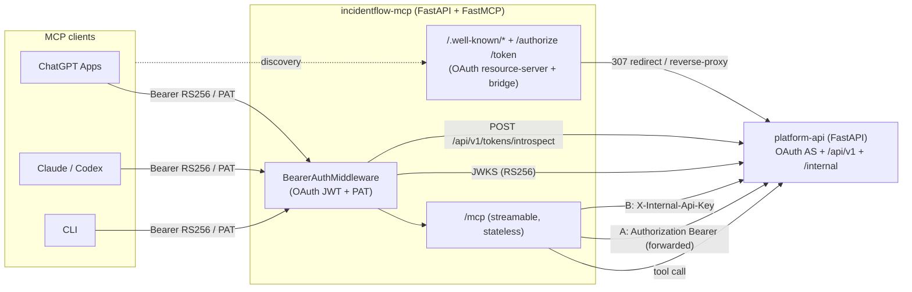

**Who authenticates with what in MCP:**

| Client | Transport | Secret | How MCP verifies it |
|---|---|---|---|
| MCP client (prod) | `Authorization: Bearer` | **RS256 JWT** (OAuth, issued by platform-api) | locally: signature via JWKS + `iss`/`aud`/`exp`/`scope` |
| MCP client (managed) | `Authorization: Bearer` | managed PAT | `POST platform-api/api/v1/tokens/introspect` |
| Local dev | `Authorization: Bearer` | local PAT `if_pat_local_*` | SHA-256 hash in `~/.incidentflow/tokens.json` |
| Local dev | `Authorization: Bearer` | static `INCIDENTFLOW_PAT` | `hmac.compare_digest` |
| Prometheus | no auth | — | allowlist by `METRICS_TRUSTED_CIDRS` for `/metrics` |

> Canonical files: entrypoint `app.py:create_app`, auth `auth/middleware.py`, OAuth validator `auth/oauth.py`, OAuth bridge `http/routers/ops.py`, `/mcp` mount `http/routes/mcp_proxy.py`.

---

## 2. Dual authentication model

The mode is set by `AUTH_MODE` (default `dual`, `config.py:auth_mode`) — "OAuth + PAT fallback enabled simultaneously". The effective mode for logs/metrics is chosen by precedence (`app.py:_auth_mode_label`):

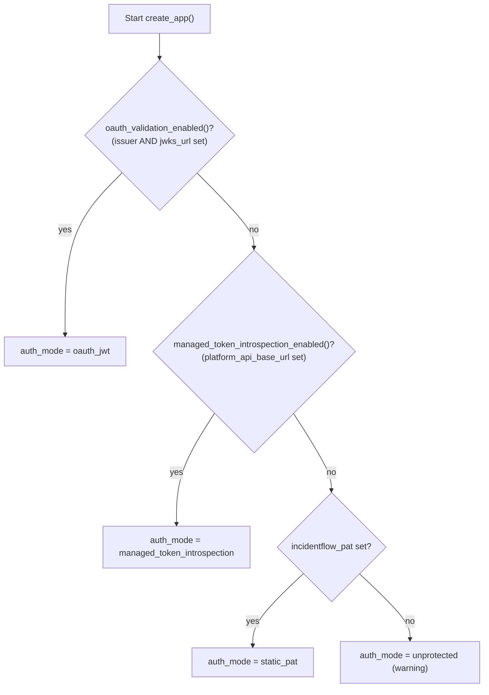

**Prod guard (`app.py:62-73`):** in `production`, if none of {static PAT, OAuth, managed introspection} is set and `ALLOW_UNPROTECTED_IN_PRODUCTION` is not true, the app **fails** at startup. Outside production, no auth means **UNPROTECTED** with a warning log (dev mode).

---

## 3. Middleware stack

In Starlette, `add_middleware` prepends, and the stack executes "last added is outermost". The actual order on an incoming request (outermost to innermost):

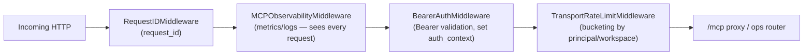

Registration order in `app.py:184-187`: `TransportRateLimit`, `BearerAuth`, `MCPObservability`, `RequestID` — so the execution order is the reverse.

Key consequences:
- **Observability and RequestID wrap auth** — metrics and `request_id` are written for every request, including ones that fail authentication.
- **Rate-limit runs after auth** — the bucket is computed on the already-resolved principal (`rate_limit_authenticated_bucket_scope` defaults to `principal`).
- OTEL `FastAPIInstrumentor` is attached separately (`app.py:instrument_fastapi_app`) — a tracing layer over the stack.
- `CORSMiddleware` is **not** added explicitly in `app.py` (CORS preflight on `/mcp` is handled by allowing the `OPTIONS` method).

---

## 4. Bearer verification chain

`auth/middleware.py:_verify_bearer` is a deterministic chain. Each validator returns `200` (success, context set), `401/403/503`, or `404` (meaning "not my format, try the next one").

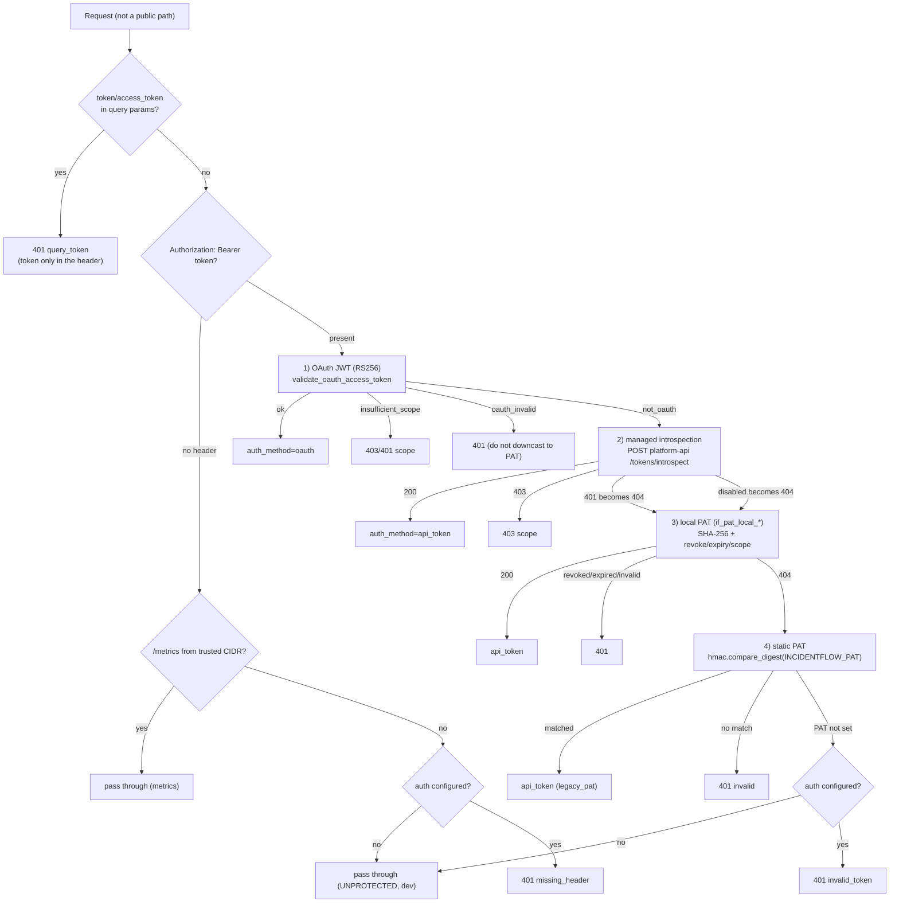

Notes:
- **Query tokens are rejected immediately** (`token`/`access_token` in the query becomes 401) — protects against leaking into logs/history.
- **OAuth is not downcast to PAT**: if a token looks like a JWT but fails (`oauth_invalid`), the result is 401 rather than falling through to the PAT branches. Only `not_oauth` (a non-JWT) proceeds further.
- `503` when JWKS or introspection is unavailable (`_service_unavailable`) — the verifier does not "pass through" on infrastructure errors.
- Every outcome records a metric `mcp_auth_failures_total{reason}` / `mcp_auth_success_total{client_id,auth_method}`; `client_id` is **redacted** for secret-like prefixes (`if_oac_`, `if_pat_`, `sk-`, `xoxb-`, ...).

---

## 5. Authentication flows

### 5.1 OAuth JWT (RS256 via JWKS) — the main prod path

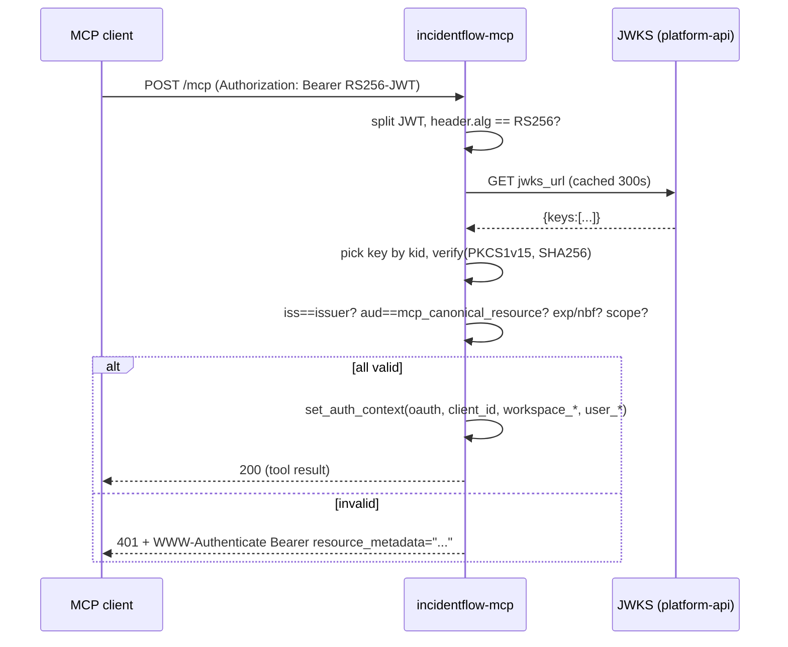

### 5.2 Managed PAT introspection (delegated to platform-api)

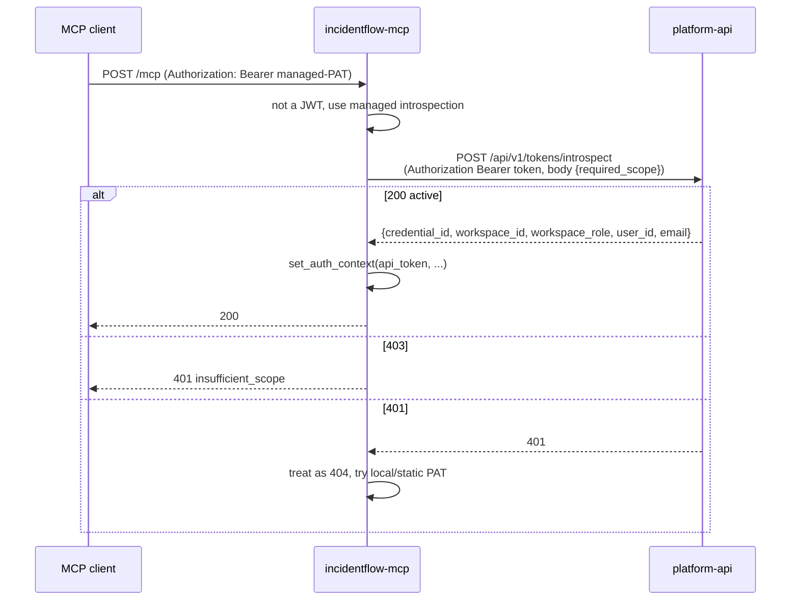

### 5.3 Local PAT (dev, JSON repository)

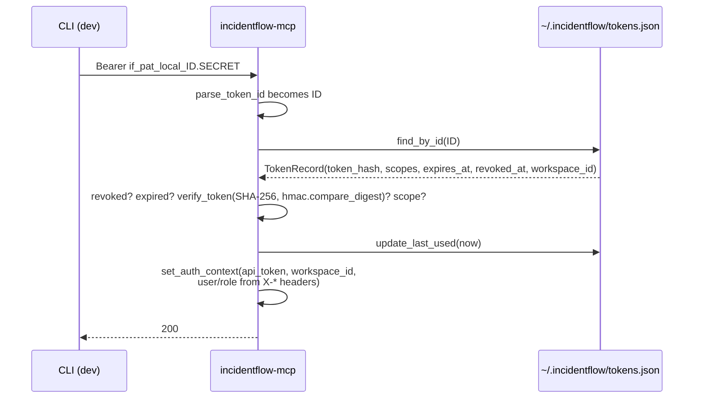

> In the local-PAT branch, `user_id`/`email`/`workspace_name`/`workspace_slug`/`workspace_role`/`plan` are taken from **request headers** `X-User-Id`, `X-User-Email`, `X-Workspace-*`, `X-Plan` (`auth/middleware.py:396-408`). This is the dev path; see [observations](#12-observations).

### 5.4 Static PAT

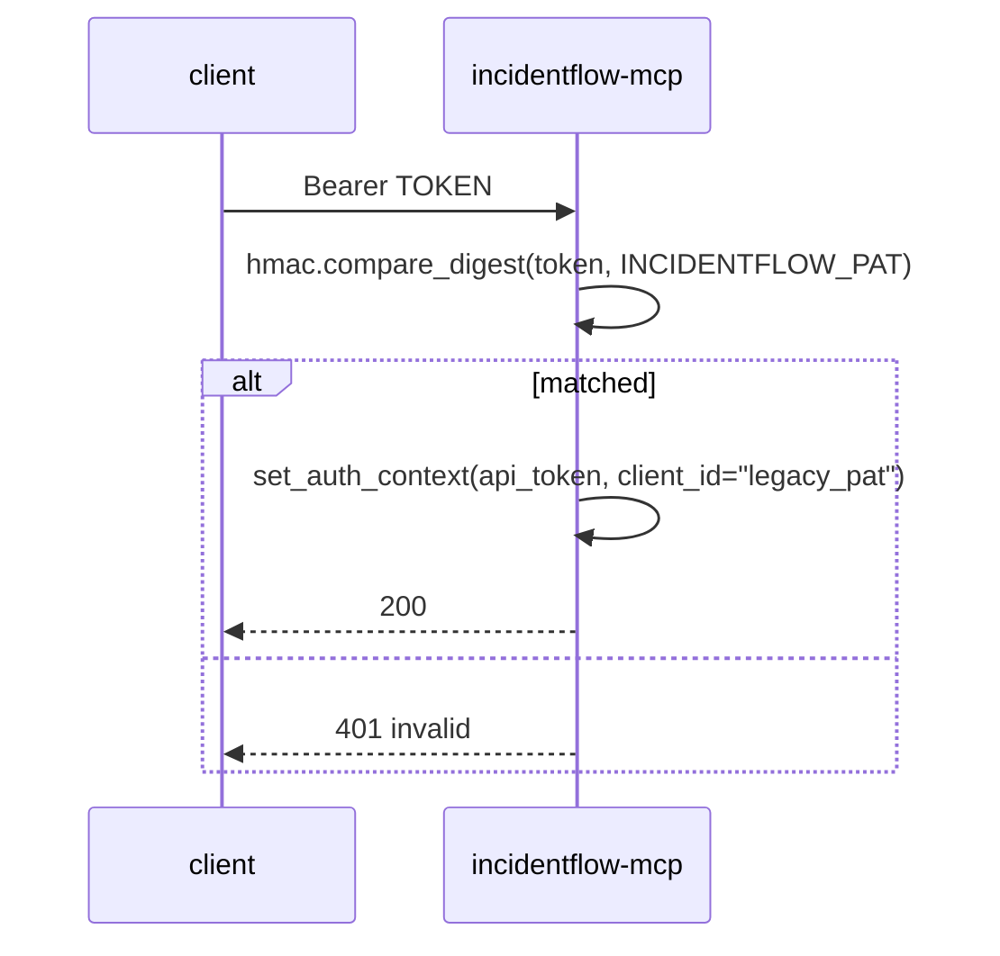

---

## 6. OAuth: MCP as a Resource Server

MCP implements **discovery + a thin bridge**; the authorization server itself lives in platform-api. The "authority base" is computed as `oauth_expected_issuer`, otherwise `platform_api_base_url`, otherwise `request.base_url` (`ops.py:_oauth_authority_base`).

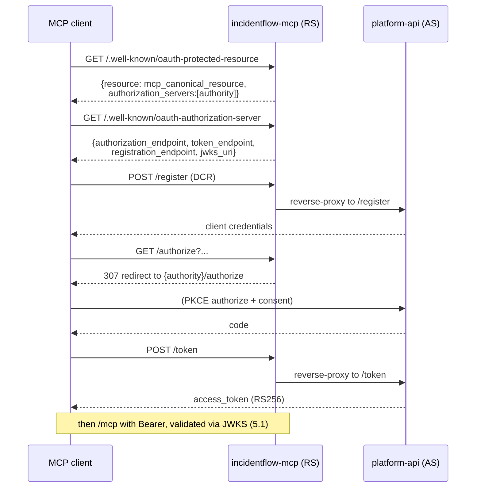

Behavior per endpoint (all are **public**, so an unauthenticated client can complete discovery and the handshake):

| Endpoint | How it is served | File |
|---|---|---|
| `/.well-known/oauth-protected-resource[/mcp]` | locally (RFC 9728): `resource` + `authorization_servers` | `ops.py:170,189` |
| `/.well-known/oauth-authorization-server` | locally (RFC 8414), endpoints point at the authority | `ops.py:208` |
| `/.well-known/openid-configuration` | locally (OIDC discovery, RS256) | `ops.py:215` |
| `/.well-known/jwks.json` | **307 redirect** to `oauth_jwks_url` | `ops.py:222` |
| `/authorize` | **307 redirect** to `{authority}/authorize` | `ops.py:236` |
| `/token`, `/revoke`, `/register`, `/oauth/register` | **reverse-proxy** (`httpx`) to the authority | `ops.py:231-254` |
| `/.well-known/{path}` | OpenAI Apps domain-verification token (otherwise 404) | `ops.py:256` |

If the authority is not configured (it resolves to the server's own base_url), the bridge/redirect returns `404 "OAuth authorization server is not configured"`.

---

## 7. Scope policy

The required scope is derived from the path prefix (`auth/middleware.py:_SCOPE_POLICY`):

| Path prefix | Required scope |
|---|---|
| `/admin` | `admin` |
| `/mcp/tools` | `mcp:tools:run` |
| `/mcp/resources` | `mcp:read` |
| `/mcp` | `mcp:read` |

**Enforcement (`config.py:scopes_enforced`)**: defaults to `True` only in `production`, otherwise `False`. So in dev the scope check for local PAT is "soft" (for OAuth and managed introspection the scope logic always applies: OAuth checks the `scope` claim, introspection returns 403). On insufficient scope: `401/403` with `WWW-Authenticate: Bearer resource_metadata="...", scope="<required>"`.

---

## 8. Principal resolution

The middleware puts identity into a `ContextVar` (`auth/context.py`) and `request.state.auth_context`, clearing it before/after each request. Tools read it via `MCPRequestContext` / `require_principal`.

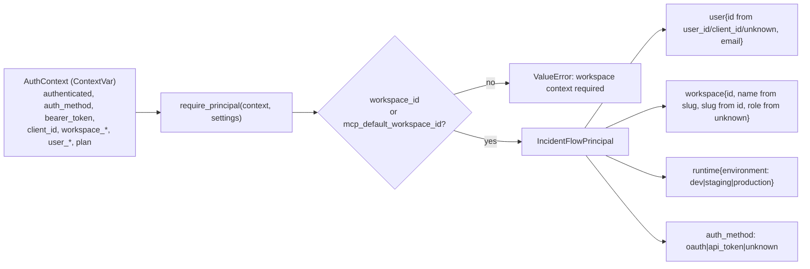

- `require_principal` (`auth/principal.py:56`) raises if the context is unauthenticated or has no workspace (neither in the token nor in `MCP_DEFAULT_WORKSPACE_ID`).
- Entry points: `mcp/request_context.py:principal()/bearer_token()/workspace_id()` and `mcp/context.py:principal()` (for the rate-limit guard).
- `bearer_token()` is **required** for Kubernetes tools (forwarded downstream, scheme A) — otherwise `MissingAuthenticationError`.

---

## 9. Route map

Public-vs-authenticated is decided by `_PUBLIC_PATHS` (`auth/middleware.py:26-47`) plus the `/schemas/` prefix and the OpenAI verification check. **The only authenticated application route is `/mcp`.**

### Public (no auth)

| Method + path | Purpose | File |
|---|---|---|
| `GET /healthz` `/readyz` | liveness/readiness | `ops.py:117,129` |
| `GET /version` | service/contract version (no secrets) | `ops.py:140` |
| `GET /schemas` `/schemas/{id}` | JSON-Schema catalog/schema | `ops.py:156,162` |
| `GET /install.sh` | curl installer | `ops.py:104` |
| `GET /.well-known/*`, `/authorize`, `/token`, `/register`, `/oauth/register`, `/revoke` | OAuth discovery + bridge (see section 6) | `ops.py:170-254` |
| `GET /docs` `/redoc` `/openapi.json` | Swagger (disabled in prod) | FastAPI |

### Metrics (conditionally public)

| `GET /metrics` | Prometheus | 200 only from `METRICS_TRUSTED_CIDRS`, otherwise 401 (`middleware.py:156,477`) |

### Authenticated

| Method + path | Auth | File |
|---|---|---|
| `GET/POST/OPTIONS /mcp` | Bearer (OAuth/PAT); OPTIONS is for CORS preflight | `mcp_proxy.py` + `app.py:191` |

`/mcp` is mounted not via `Mount` but through a custom `MCPASGIProxyRoute` (exact path, unmodified ASGI scope) — otherwise FastMCP routing breaks on an empty `path`. Transport is **streamable HTTP, stateless** (`mcp/server.py`); the session manager runs in the lifespan (`app.py:146`).

---

## 10. Downstream

MCP calls platform-api using **two schemes**, chosen by endpoint semantics. There is no single client: each `platform_api/*` and some `tools/*` clients build their own `httpx.AsyncClient`.

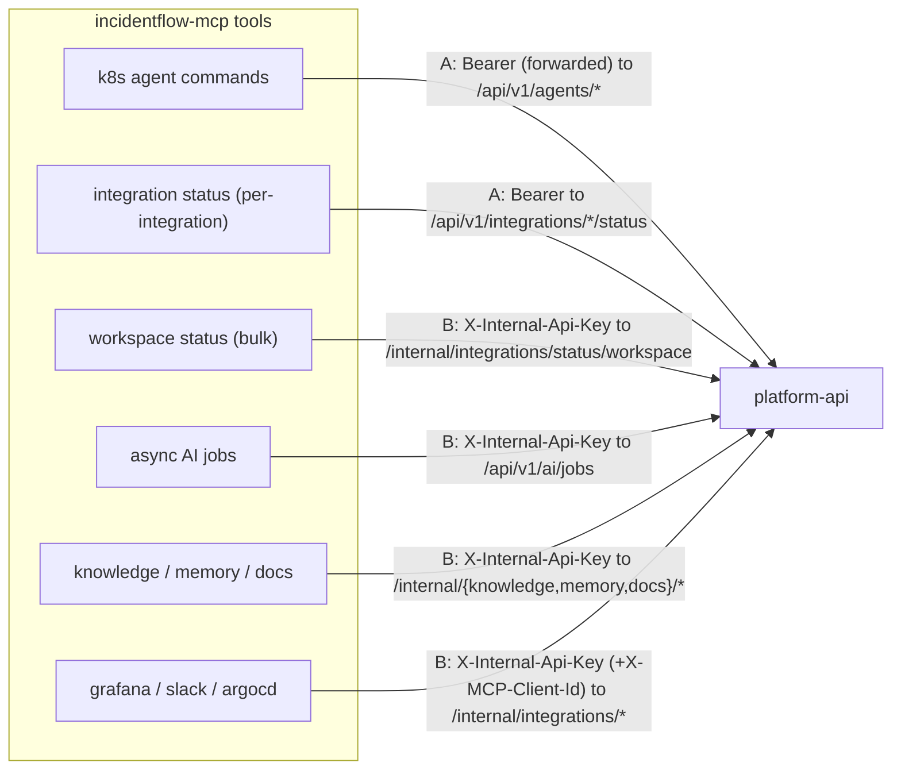

**Scheme A — forward the user's `Authorization: Bearer`** (platform-api authorizes as the user):

| Operation | Downstream | File |
|---|---|---|
| K8s: list clusters | `GET /api/v1/agents/clusters` | `agent_commands_client.py:25` |
| K8s: command to agent | `POST /api/v1/agents/clusters/{id}/commands` | `agent_commands_client.py:88` |
| Integration status (slack/grafana/argocd) | `GET /api/v1/integrations/{x}/status` | `integration_status_client.py:41` |
| Token introspection (in the middleware itself) | `POST /api/v1/tokens/introspect` | `middleware.py:298` |

**Scheme B — internal key `X-Internal-Api-Key`** (S2S, `PLATFORM_API_INTERNAL_TOKEN`):

| Operation | Downstream | File |
|---|---|---|
| Workspace status (bulk) | `GET /internal/integrations/status/workspace` | `integration_status_client.py:76` |
| Async AI jobs | `POST /api/v1/ai/jobs`, `GET/POST .../{id}[/cancel]` | `ai_jobs_client.py` |
| Knowledge search/get | `POST /internal/knowledge/search` `/get` | `knowledge_search_tools.py:79,121` |
| Memory search/upsert | `POST /internal/memory/search` `/upsert` | `memory_tools.py:94,176` |
| Docs search | `POST /internal/docs/search` | `docs_tools.py:46` |
| Grafana | `/internal/integrations/grafana/*` (+ `X-MCP-Client-Id`) | `grafana_client.py` |
| Slack | `/internal/integrations/slack/*` (+ `X-MCP-Client-Id`) | `slack_client.py` |
| Argo CD | `/internal/integrations/argocd/*` (+ `X-MCP-Client-Id`) | `argocd_client.py` |

> For integration status: when the internal key is set, the bulk endpoint (scheme B) is preferred; otherwise it falls back to per-integration Bearer calls (scheme A) — `integrations.py:97-114`.

---

## 11. Configuration

| Setting | Env / alias | Default | Role |
|---|---|---|---|
| `oauth_expected_issuer` | `OAUTH_EXPECTED_ISSUER` | `None` | expected JWT `iss` |
| `oauth_jwks_url` | `OAUTH_JWKS_URL` | `None` | JWKS for RS256 verification |
| `oauth_validation_enabled()` | — | issuer **and** jwks set | enables OAuth mode |
| `mcp_canonical_resource` | `MCP_CANONICAL_RESOURCE` | `https://mcp.incidentflow.io/mcp` | expected JWT `aud` |
| `mcp_resource_metadata_url` | — | `.../.well-known/oauth-protected-resource` | in `WWW-Authenticate` |
| `platform_api_base_url` | `PLATFORM_API_BASE_URL` / `INCIDENTFLOW_API_BASE_URL` | `None` | base for introspection + downstream |
| `platform_api_introspect_path` | — | `/api/v1/tokens/introspect` | introspection endpoint |
| `managed_token_introspection_enabled()` | — | `bool(platform_api_base_url)` | enables managed PAT |
| `platform_api_internal_api_key` | `PLATFORM_API_INTERNAL_TOKEN` / `PLATFORM_API_INTERNAL_API_KEY` | `None` | scheme-B key |
| `incidentflow_pat` | `INCIDENTFLOW_PAT` | `None` | static dev PAT |
| `auth_mode` | `AUTH_MODE` | `dual` | OAuth + PAT fallback |
| `enforce_scopes` / `scopes_enforced()` | `ENFORCE_SCOPES` | `None` becomes True in prod | scope enforcement |
| `platform_api_timeout_seconds` | — | `5.0` | timeout for JWKS/introspect/proxy |
| `metrics_trusted_cidrs` | `METRICS_TRUSTED_CIDRS` | `127/8,::1,10/8,172.16/12,192.168/16` | `/metrics` access without auth |
| `openai_domain_verification_path/_token` | — | `None` | OpenAI Apps domain verification |
| `allow_unprotected_in_production` | `ALLOW_UNPROTECTED_IN_PRODUCTION` | `False` | bypass the prod guard |
| `mcp_default_workspace_id` | `INCIDENTFLOW_WORKSPACE_ID` / `MCP_DEFAULT_WORKSPACE_ID` | `None` | default workspace |

---

## 12. Observations

> These are engineering observations from the code, **not** a formal security audit. Exploitability and priority should be confirmed by the security team; some items are intentional dev behavior.

| # | Observation | Where | Note |
|---|---|---|---|
| N-1 | **Dev fail-open**: with no auth configured outside production, `/mcp` is open (warning log). In prod it is closed by the guard `app.py:62-73`. | `middleware.py:158,212` | intentional for local dev; in prod only via `ALLOW_UNPROTECTED_IN_PRODUCTION` |
| N-2 | **Local PAT trusts `X-*` headers** for `user_id/email/workspace_name/role/plan`. | `middleware.py:396-408` | dev path; for managed/OAuth the identity comes from the AS |
| N-3 | **JWKS falls back to the first key** if the `kid` does not match (`key is None and keys`). The signature must still verify — not a bypass, but worth being aware of. | `oauth.py:93-96` | confirm intent for a multi-key JWKS |
| N-4 | **`_PUBLIC_PATHS` and the routes are kept in sync by hand** — a new route without updating the set defaults to authenticated (fail-closed, which is fine); the reverse is not. | `middleware.py:26-47` | coupling, document it |
| N-5 | **Scope is not enforced outside production** for local PAT (`scopes_enforced` becomes False). | `config.py:174-178` | dev-friendly by design |
| N-6 | **Scheme B (`X-Internal-Api-Key`) bypasses per-user authorization** — workspace isolation for grafana/slack/argocd/knowledge relies on the context MCP passes. | `platform_api/*` | verify platform-api validates `workspace_id` on `/internal/*` |
| N-7 | **Static PAT is a single shared secret** with no scope/expiry/revoke. | `middleware.py:412` | local dev only; constant-time comparison is fine |

**Done right:**
- OAuth Resource Server per RFC 9728/8414 with the AS delegated to platform-api; RS256 + JWKS with a cache.
- Query tokens are rejected; secret-like `client_id` values are redacted in metrics.
- Constant-time comparison (`hmac.compare_digest`) for PAT; on-disk tokens are SHA-256 only.
- Downstream separation: user-scoped operations use the user's Bearer (platform-api authorizes as the user), internal ones use the S2S key.
- Prod guard against an unprotected startup; `/metrics` behind a CIDR allowlist.

---

## 13. Legend

- **Public** — no auth (discovery/health/schemas/OAuth-bridge).
- **Metrics** — public only from trusted CIDRs.
- **Authenticated** — a valid Bearer (OAuth JWT or PAT); `/mcp` only.
- **Scheme A** — forward the user's `Authorization: Bearer` downstream to platform-api.
- **Scheme B** — S2S `X-Internal-Api-Key` to platform-api `/internal/*`.

**Canonical files for navigation:**
- Entrypoint/assembly: `src/incidentflow_mcp/app.py`
- Auth middleware: `src/incidentflow_mcp/auth/middleware.py`
- OAuth validator (RS256/JWKS): `src/incidentflow_mcp/auth/oauth.py`
- Tokens/repository (local PAT): `src/incidentflow_mcp/auth/tokens.py`, `auth/repository.py`
- Principal/context: `src/incidentflow_mcp/auth/principal.py`, `auth/context.py`, `mcp/request_context.py`
- OAuth discovery + bridge + ops: `src/incidentflow_mcp/http/routers/ops.py`
- `/mcp` mount: `src/incidentflow_mcp/http/routes/mcp_proxy.py`
- MCP server: `src/incidentflow_mcp/mcp/server.py`
- Downstream clients: `src/incidentflow_mcp/platform_api/*`, `tools/{knowledge_search,memory,docs}_tools.py`
- Config: `src/incidentflow_mcp/config.py`
